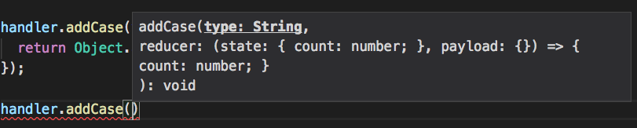
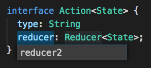
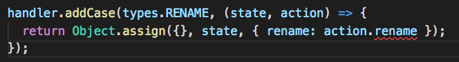
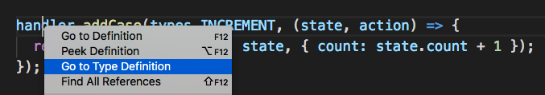

# TypeScript入門

---

# 目次

1. TypeScriptとは
2. TypeScriptを使うメリット
3. 文法
4. 環境構築
5. 最新のTypeScript事情
6. ライブラリとして配布する際のコツ

---

## 1. TypeScriptとは

JavaScriptの文法に型を追加したJavaScriptのスーパーセット

`interface`や`type`など他のプログラミング言語でおなじみの文法が`JavaScript`でも使用できるようになる

---

## 2. TypeScriptを使うメリット

- メンテナンス性、保守性の高いコードがかける
- VSCodeなどのエディタの恩恵が受けられる

---

## 2. TypeScriptを使うメリット
### VSCodeなどのエディタの恩恵が受けられる

- メソッドや変数の型情報表示
- プロパティの一括置換
- 変数のエラーチェック
- 型定義している場所に移動

---

## 2. TypeScriptを使うメリット

メソッドや変数の型情報表示



---

## 2. TypeScriptを使うメリット
### VSCodeなどのエディタの恩恵が受けられる

プロパティの一括置換



---

## 2. TypeScriptを使うメリット
### VSCodeなどのエディタの恩恵が受けられる

変数のエラーチェック




---

## 2. TypeScriptを使うメリット
### VSCodeなどのエディタの恩恵が受けられる

型定義している場所に移動




---

## 3. 文法

type

```js
let str: string = 'godai';
str = 3; //error!

const plus = (a: number, b: number) : number => {
  return `${a} ${b}`; //error! 
}
```

---

## 3. 文法

inteface

```js
interface Human {
  age: number,
  name: string
}

const hoge: Human = {
  gender: 'man' //error genderは定義されていない
}
```

---

## 3. 文法

Generics

```js
class Hoge<State> {
  state: State,
  constructor(state: State) {
    this.state = state;
  }
}

const hoge = new Hoge({ name: 'hoge' });
hoge.age // error!
hoge.name // 'hoge'
```

---

## 4. 環境構築

1. TypeScript only
2. TypeScript + Babel7

---

## 4. 環境構築
### TypeScript only

```sh
npm install webpack webpack-cli ts-loader --save
```

---

## 4. 環境構築
### TypeScript only

```js
module.exports = {
    resolve: {
      extensions: ['.ts', '.tsx', '.js', '.json']
    },
    module: {
        rules: [
            {
                test: /\.ts|\.tsx$/,
                exclude: /node_modules/,
                use: {
                    loader: "ts-loader"
                }
            }
        ]
    }
};
```

---

## 4. 環境構築
### TypeScript only

```json
{
    "compilerOptions": {
        "sourceMap": true,
        // TSはECMAScript 5に変換
        "target": "es5",
        // TSのモジュールはES Modulesとして出力
        "module": "es2015",
        // JSXの書式を有効に設定
        "jsx": "react",
        "moduleResolution": "node",
        "lib": [
        "es2018",
        "dom"
        ]
    }
}
```

---

## 4. 環境構築
### TypeScript + Babel7

[https://github.com/Microsoft/TypeScript-Babel-Starter](https://github.com/Microsoft/TypeScript-Babel-Starter)


```sh
npm install --save-dev typescript@3.0.1
npm install --save-dev @babel/core@7.0.0
npm install --save-dev @babel/cli@7.0.0
npm install --save-dev @babel/plugin-proposal-class-properties@7.0.0
npm install --save-dev @babel/plugin-proposal-object-rest-spread@7.0.0
npm install --save-dev @babel/preset-env@7.0.0
npm install --save-dev @babel/preset-typescript@7.0.0
```

---

## 4. 環境構築
### TypeScript + Babel7

```sh
tsc 
--init 
--declaration 
--allowSyntheticDefaultImports 
--target esnext 
--outDir lib
```

---

## 4. 環境構築
### TypeScript + Babel7

```json
{
    "presets": [
        "@babel/env",
        "@babel/typescript"
    ],
    "plugins": [
        "@babel/proposal-class-properties",
        "@babel/proposal-object-rest-spread"
    ]
}
```

---

## 4. 環境構築
### TypeScript + Babel7

```js
module.exports = {
    entry: './src/index',
    output: {
        path: path.resolve(__dirname, 'dist'),
        filename: 'app.bundle.js'
    },
    resolve: {
        extensions: ['.ts', '.tsx', '.js', '.json']
    },
    module: {
        rules: [{
            test: /\.(tsx?)|(js)$/,
            exclude: /node_modules/,
            loader: 'babel-loader',
        }],
    }
};
```

---

## 5. 最新のTypeScript事情


