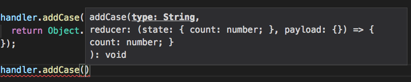
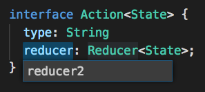

# TypeScript入門

---

# 目次

1. TypeScriptとは
2. TypeScriptを使うメリット
3. 文法
4. 環境構築
5. 最新のTypeScript事情
6. ライブラリとして配布する際のコツ

---

## 1. TypeScriptとは

JavaScriptの文法に型を追加したJavaScriptのスーパーセット

`interface`や`type`など他のプログラミング言語でおなじみの文法が`JavaScript`でも使用できるようになる

---

## 2. TypeScriptを使うメリット

- メンテナンス性、保守性の高いコードがかける
- VSCodeなどのエディタの恩恵が受けられる

---

## 2. TypeScriptを使うメリット
### VSCodeなどのエディタの恩恵が受けられる

- メソッドや変数の型情報表示
- プロパティの一括置換
- 変数のエラーチェック
- 型定義している場所に移動

---

## 2. TypeScriptを使うメリット

メソッドや変数の型情報表示



---

## 2. TypeScriptを使うメリット
### VSCodeなどのエディタの恩恵が受けられる

プロパティの一括置換



---

## 2. TypeScriptを使うメリット
### VSCodeなどのエディタの恩恵が受けられる

変数のエラーチェック


---

## 2. TypeScriptを使うメリット
### VSCodeなどのエディタの恩恵が受けられる

型定義している場所に移動


---

## 3. 文法

違うtypeの値を代入できない

```js
let str: string = 'godai';
str = 3; //error!
```

---

## 3. 文法

inteface

```js
interface Human {
  age: number,
  name: string
}

const hoge: Human = {
  gender: 'man' //error genderは定義されていない
}
```


